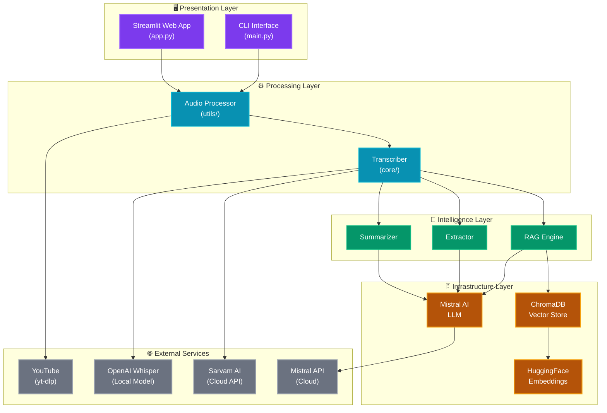
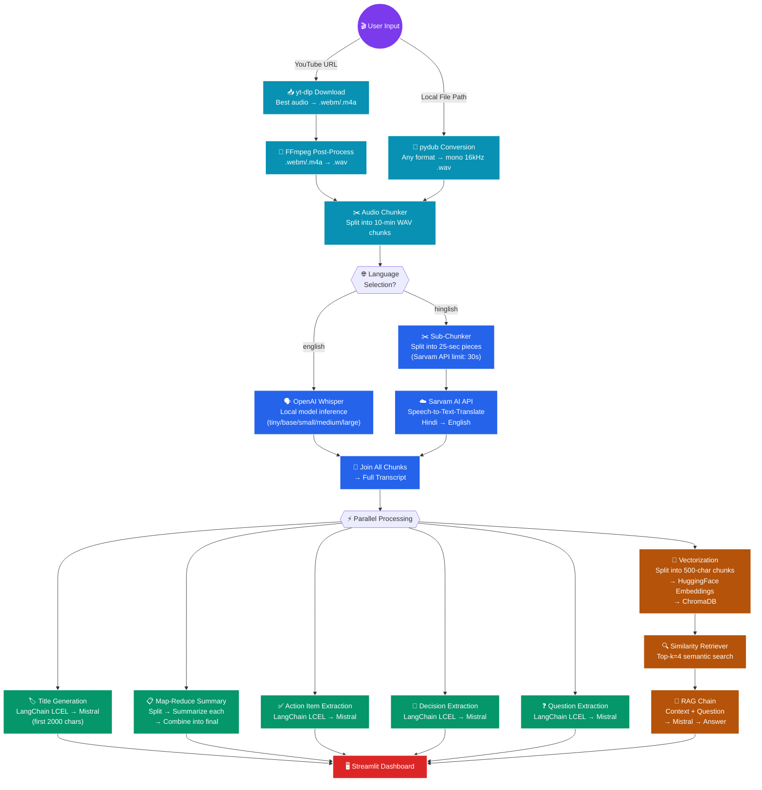
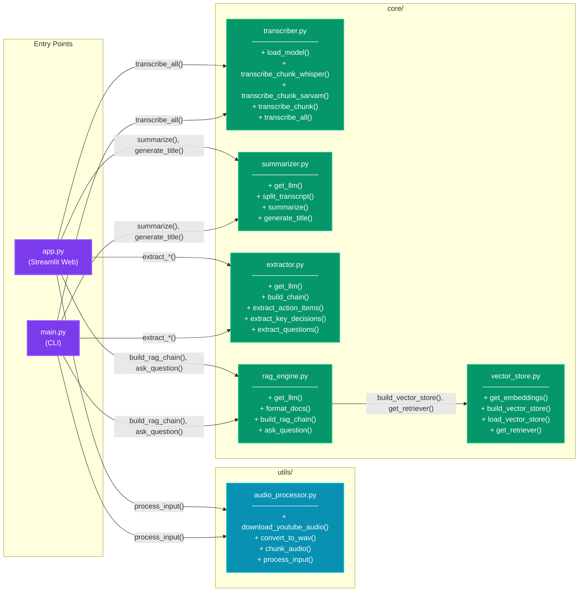
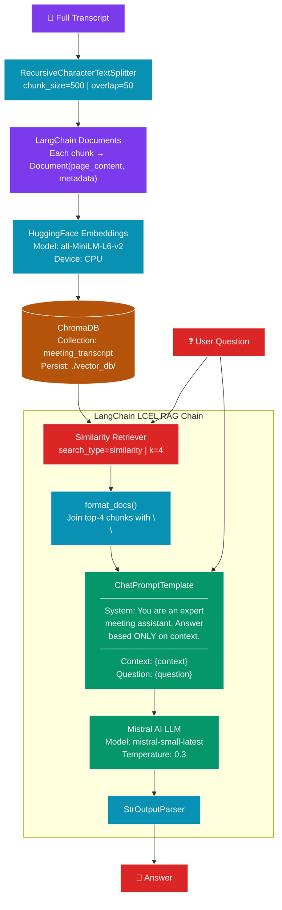
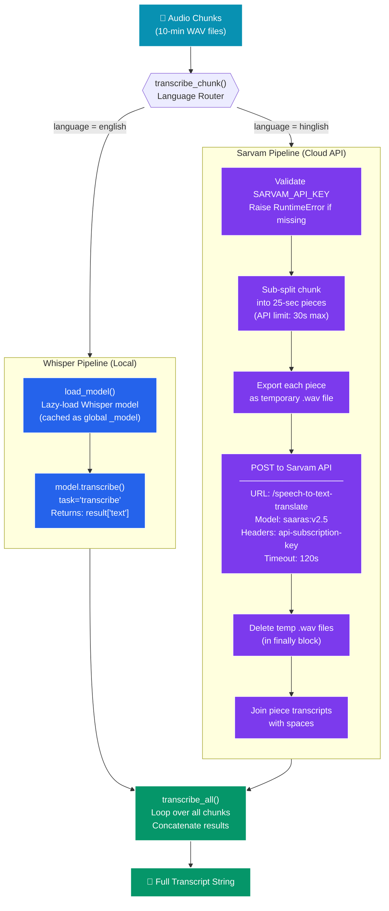
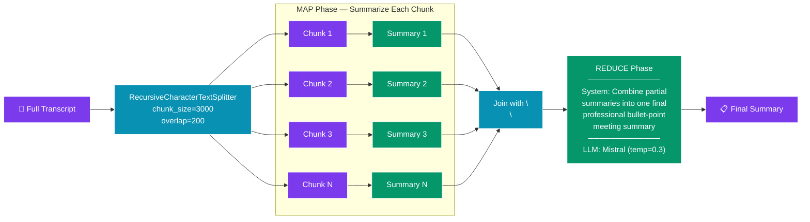

# 🎬 AI Video / Meeting Assistant

<div align="center">

**Turn hours of meetings and YouTube videos into concise, actionable intelligence — in minutes.**

[](https://python.org)
[](https://streamlit.io)
[](https://langchain.com)
[](https://mistral.ai)
[](https://github.com/openai/whisper)
[](https://www.trychroma.com/)

</div>

---

## 📑 Table of Contents

- [Overview](#-overview)
- [Features](#-features)
- [System Architecture](#%EF%B8%8F-system-architecture)
  - [High-Level Architecture](#high-level-architecture)
  - [Data Flow Pipeline](#data-flow-pipeline)
  - [Module Interaction Map](#module-interaction-map)
  - [RAG Pipeline Deep Dive](#rag-pipeline-deep-dive)
  - [Transcription Engine Detail](#transcription-engine-detail)
- [Tech Stack](#-tech-stack)
- [Project Structure](#-project-structure)
- [Module Deep Dive](#-module-deep-dive)
  - [Audio Processor](#1-audio-processor-utilsaudio_processorpy)
  - [Transcriber](#2-transcriber-coretransciberpy)
  - [Summarizer](#3-summarizer-coresummarizerpy)
  - [Extractor](#4-extractor-coreextractorpy)
  - [Vector Store](#5-vector-store-corevector_storepy)
  - [RAG Engine](#6-rag-engine-corerag_enginepy)
  - [Streamlit App](#7-streamlit-app-apppy)
  - [CLI Entry Point](#8-cli-entry-point-mainpy)
- [Getting Started](#-getting-started)
- [How to Use](#-how-to-use)
- [Configuration Reference](#-configuration-reference)
- [API & External Services](#-api--external-services)
- [Troubleshooting](#-troubleshooting)
- [License](#-license)

---

## 🔭 Overview

The **AI Video Assistant** is an end-to-end intelligent meeting analysis application. It ingests video or audio content from **YouTube URLs** or **local files**, transcribes it using state-of-the-art speech-to-text engines, and then leverages **Large Language Models (LLMs)** to produce:

| Output | Description |
|---|---|
| 📌 **Smart Title** | An auto-generated professional title for the session |
| 📋 **Bullet-Point Summary** | A concise summary combining all discussion points |
| ✅ **Action Items** | Tasks with owners and deadlines extracted from the transcript |
| 🔑 **Key Decisions** | Important decisions made during the meeting |
| ❓ **Open Questions** | Unresolved questions needing follow-up |
| 💬 **RAG Chat** | An interactive chat interface to ask questions about the meeting |

The application features a premium **Streamlit** web interface with a dark-mode glassmorphism design, real-time pipeline status tracking, and a conversational chat experience powered by **Retrieval-Augmented Generation (RAG)**.

---

## ✨ Features

### Media Ingestion
- **YouTube URL** — Automatically downloads the best-quality audio from any YouTube video using `yt-dlp` + `FFmpeg`.
- **Local File** — Supports any local audio/video format (`.mp4`, `.mkv`, `.webm`, `.mp3`, `.wav`, etc.) via `pydub` conversion.

### Dual-Engine Transcription
- **OpenAI Whisper (Local)** — For high-accuracy English transcription, runs entirely offline on your machine.
- **Sarvam AI (Cloud)** — For Hinglish (Hindi + English) audio, provides transcription with real-time translation to English.

### LLM-Powered Analysis
- **Map-Reduce Summarization** — Handles transcripts of any length by splitting, summarizing chunks, and recombining.
- **Structured Insight Extraction** — Three dedicated LangChain LCEL chains extract action items, decisions, and open questions.

### Interactive RAG Chat
- **ChromaDB Vector Store** — Embeds transcript chunks as vectors for efficient semantic retrieval.
- **HuggingFace Embeddings** — Uses `all-MiniLM-L6-v2` sentence-transformer for high-quality, lightweight embeddings.
- **Context-Aware Q&A** — Ask any question about the meeting and get precise answers grounded in the transcript.

### Premium UI/UX
- Dark-mode interface with animated grid background and glassmorphism effects.
- Live pipeline status indicators with animated dots.
- Card-based dashboard for results with hover effects.
- Integrated chat UI with distinct user/assistant message bubbles.

---

## 🏗️ System Architecture

### High-Level Architecture

This diagram shows the overall system architecture, illustrating how user input flows through the processing layers to produce the final outputs.



---

### Data Flow Pipeline

This diagram traces the complete journey of a single user request — from input to final rendered output — showing every processing step in sequence.



---

### Module Interaction Map

This class-like diagram shows how every Python module in the project relates to every other, including the specific functions that form the inter-module API.



---

### RAG Pipeline Deep Dive

This diagram illustrates the internal architecture of the Retrieval-Augmented Generation pipeline — the component that powers the "Chat with your Meeting" feature.



---

### Transcription Engine Detail

This diagram illustrates the dual-engine transcription system showing how audio chunks are routed and processed differently depending on the chosen language.



---

### Summarization — Map-Reduce Strategy

This diagram shows how the summarizer handles transcripts of arbitrary length using the map-reduce pattern.



---

## 🛠️ Tech Stack

| Category | Technology | Purpose |
|---|---|---|
| **Frontend** | Streamlit 1.35+ | Web application UI framework |
| **LLM** | Mistral AI (`mistral-small-latest`) | Summarization, extraction, RAG answers |
| **LLM Framework** | LangChain (LCEL) | Prompt templating, chain orchestration |
| **Speech-to-Text** | OpenAI Whisper (local) | English transcription |
| **Speech-to-Text** | Sarvam AI (cloud) | Hinglish transcription + translation |
| **Vector Database** | ChromaDB | Semantic similarity search storage |
| **Embeddings** | HuggingFace `all-MiniLM-L6-v2` | Sentence-level text embeddings |
| **Audio Processing** | `pydub` + `FFmpeg` | Audio format conversion & chunking |
| **Video Download** | `yt-dlp` | YouTube audio extraction |
| **Environment** | `python-dotenv` | Secure API key management |

---

## 📂 Project Structure

```text
📁 AI-Video-Assistant--main/
│
├── 📄 app.py                    # Streamlit web application — full UI + pipeline orchestration
├── 📄 main.py                   # CLI entry point — terminal-based pipeline + interactive chat
├── 📄 test.py                   # Quick integration test script for the core pipeline
├── 📄 Requirements.txt          # All Python dependencies with version constraints
├── 📄 .env.example              # Template for required environment variables
├── 📄 .gitignore                # Git ignore rules (excludes .env)
│
├── 📁 core/                     # Core application logic — AI/ML modules
│   ├── 📄 transcriber.py        # Dual-engine transcription (Whisper + Sarvam AI)
│   ├── 📄 summarizer.py         # LangChain LCEL chains for title + bullet-point summary
│   ├── 📄 extractor.py          # LangChain LCEL chains for action items, decisions, questions
│   ├── 📄 vector_store.py       # ChromaDB setup — embedding, storage, retriever creation
│   └── 📄 rag_engine.py         # Full RAG pipeline — build chain, format docs, answer queries
│
├── 📁 utils/                    # Helper utilities
│   └── 📄 audio_processor.py    # YouTube download (yt-dlp), WAV conversion (pydub), chunking
│
└── 📁 downloades/               # Downloaded audio files from YouTube (auto-created)
```

---

## 🔬 Module Deep Dive

### 1. Audio Processor (`utils/audio_processor.py`)

**Responsibility:** Ingests raw user input (YouTube URL or local file path) and produces a list of manageable audio chunk file paths ready for transcription.

#### Key Functions

| Function | Signature | Description |
|---|---|---|
| `download_youtube_audio` | `(url: str) → str` | Uses `yt-dlp` to download the best audio stream from a YouTube URL. Post-processes with FFmpeg to produce a `.wav` file. Automatically resolves FFmpeg binary via `imageio-ffmpeg` when system FFmpeg is unavailable. |
| `convert_to_wav` | `(input_path: str) → str` | Converts any local audio/video file to mono 16kHz WAV format using `pydub`. This standardized format is required by Whisper for optimal transcription accuracy. |
| `chunk_audio` | `(wav_path: str, chunk_minutes: int = 10) → list` | Splits a WAV file into sequential chunks of `chunk_minutes` (default: 10 minutes). Each chunk is exported as a separate `.wav` file. This prevents memory issues with long recordings. |
| `process_input` | `(source: str) → list` | **Main entry point.** Auto-detects whether the source is a URL or local path, downloads/converts accordingly, and returns the list of chunk paths. |

#### Internal Logic Flow

1. **FFmpeg Resolution** — On import, checks if `ffmpeg` is on `PATH`. If not, attempts to use the bundled `imageio-ffmpeg` package (particularly useful on Windows).
2. **URL Detection** — Simple prefix check for `http://` or `https://` to determine input type.
3. **Audio Normalization** — All audio is converted to **mono channel, 16kHz sample rate** — the optimal input format for Whisper.

---

### 2. Transcriber (`core/transcriber.py`)

**Responsibility:** Converts audio chunks into text using either a local Whisper model or the cloud-based Sarvam AI API, depending on the chosen language.

#### Key Functions

| Function | Signature | Description |
|---|---|---|
| `load_model` | `() → whisper.Model` | Lazy-loads the Whisper model (specified by `WHISPER_MODEL` env var, default `"small"`). Uses a global `_model` cache to avoid reloading on subsequent calls. |
| `transcribe_chunk_whisper` | `(chunk_path: str) → str` | Transcribes a single WAV chunk using the locally-loaded Whisper model. |
| `transcribe_chunk_sarvam` | `(chunk_path: str) → str` | Handles Sarvam AI's 30-second audio limit by sub-splitting each chunk into 25-second pieces, sending each to the API, and joining the results. Temp files are cleaned up in a `finally` block. |
| `_send_to_sarvam` | `(piece_path: str) → str` | Low-level function that sends a single ≤30s WAV file to the Sarvam `speech-to-text-translate` endpoint via multipart POST request. |
| `transcribe_chunk` | `(chunk_path: str, language: str) → str` | **Router function.** Dispatches to Whisper or Sarvam based on the `language` parameter. |
| `transcribe_all` | `(chunks: list, language: str) → str` | Iterates over all audio chunks, transcribes each, and joins the results into a single full transcript string. |

#### Design Decisions

- **Whisper Model Caching:** The Whisper model is expensive to load (hundreds of MB). The global `_model` pattern ensures it's loaded only once per application lifecycle.
- **Sarvam Sub-Chunking:** The Sarvam sync API rejects audio longer than 30 seconds. The 25-second split (with a 5-second safety margin) ensures reliable API calls while maximizing per-request content.
- **Temp File Cleanup:** Each Sarvam sub-chunk creates a temporary WAV file. These are deleted in a `finally` block to prevent disk pollution even when API calls fail.

---

### 3. Summarizer (`core/summarizer.py`)

**Responsibility:** Generates a professional meeting title and a concise bullet-point summary from the full transcript using LangChain LCEL chains and Mistral AI.

#### Key Functions

| Function | Signature | Description |
|---|---|---|
| `get_llm` | `() → ChatMistralAI` | Factory for the Mistral LLM instance (`mistral-small-latest`, temperature 0.3). |
| `split_transcript` | `(transcript: str) → list` | Splits the transcript into 3000-character chunks with 200-character overlap using `RecursiveCharacterTextSplitter`. |
| `summarize` | `(transcript: str) → str` | **Map-Reduce summarization.** First summarizes each chunk independently (MAP), then combines all chunk summaries into a single final professional summary (REDUCE). |
| `generate_title` | `(transcript: str) → str` | Generates a short (≤8 words) professional meeting title from the first 2000 characters of the transcript. |

#### Map-Reduce Strategy

The summarizer implements a classic **Map-Reduce** pattern to handle transcripts of any length:

1. **MAP:** Each 3000-character chunk is independently summarized by Mistral.
2. **COMBINE:** All chunk summaries are joined with double newlines.
3. **REDUCE:** A final Mistral call takes the combined summaries and produces one cohesive, professional bullet-point summary.

This approach ensures the application can process multi-hour meetings without hitting LLM context-window limits.

---

### 4. Extractor (`core/extractor.py`)

**Responsibility:** Extracts structured, actionable insights from the transcript using dedicated LangChain LCEL chains, each with a specialized system prompt.

#### Key Functions

| Function | Signature | Description |
|---|---|---|
| `get_llm` | `() → ChatMistralAI` | Factory for Mistral LLM (temperature 0.2 — lower than summarizer for more deterministic extraction). |
| `build_chain` | `(system_prompt: str) → Runnable` | Generic LCEL chain builder: `RunnablePassthrough → lambda wrapping → ChatPromptTemplate → LLM → StrOutputParser`. |
| `extract_action_items` | `(transcript: str) → str` | Extracts action items with **task description**, **owner**, and **deadline** for each. |
| `extract_key_decisions` | `(transcript: str) → str` | Extracts all key decisions made during the meeting. |
| `extract_questions` | `(transcript: str) → str` | Extracts unresolved questions and topics needing follow-up. |

#### Design Pattern

All three extraction functions share the same `build_chain()` factory, differing only in their system prompts. This pattern:
- Eliminates code duplication.
- Makes it trivial to add new extractors (e.g., sentiment analysis, topic tagging) by adding a new function with a new system prompt.
- Uses a slightly lower temperature (0.2) compared to the summarizer (0.3) for more deterministic, structured outputs.

---

### 5. Vector Store (`core/vector_store.py`)

**Responsibility:** Manages the ChromaDB vector store lifecycle — creating embeddings from transcript text and providing a retriever interface for the RAG engine.

#### Key Functions

| Function | Signature | Description |
|---|---|---|
| `get_embeddings` | `() → HuggingFaceEmbeddings` | Returns a HuggingFace embeddings model (`all-MiniLM-L6-v2`) configured for CPU inference. |
| `build_vector_store` | `(transcript: str) → Chroma` | Splits the transcript into 500-character chunks (50-char overlap), wraps them as `Document` objects with `chunk_index` metadata, embeds them, and stores in ChromaDB. |
| `load_vector_store` | `() → Chroma` | Loads an existing vector store from the persisted directory (useful for resuming sessions without re-embedding). |
| `get_retriever` | `(vector_store: Chroma, k: int = 4) → Retriever` | Wraps the vector store as a LangChain retriever with `similarity` search, returning the top `k` most relevant chunks. |

#### Configuration

| Parameter | Value | Rationale |
|---|---|---|
| Chunk Size | 500 characters | Small enough for precise retrieval, large enough for context |
| Chunk Overlap | 50 characters | Prevents information loss at chunk boundaries |
| Embedding Model | `all-MiniLM-L6-v2` | Fast, lightweight (22M params), excellent sentence-level quality |
| Retriever k | 4 | Balances context richness with prompt length |
| Collection Name | `meeting_transcript` | Single-collection design for simplicity |
| Persist Directory | `./vector_db/` | Local persistence for session recovery |

---

### 6. RAG Engine (`core/rag_engine.py`)

**Responsibility:** Orchestrates the full Retrieval-Augmented Generation pipeline — from receiving a user question to returning a context-grounded answer.

#### Key Functions

| Function | Signature | Description |
|---|---|---|
| `get_llm` | `() → ChatMistralAI` | Factory for Mistral LLM (temperature 0.3). |
| `format_docs` | `(docs: list) → str` | Joins retrieved `Document` objects into a single context string, separated by double newlines. |
| `build_rag_chain` | `(transcript: str) → Runnable` | **Main builder.** Creates the vector store, retriever, and assembles the full LCEL RAG chain. Returns a runnable that accepts a question string and returns an answer string. |
| `load_rag_chain` | `() → Runnable` | Loads a previously-built RAG chain from persisted ChromaDB (for session recovery). |
| `ask_question` | `(rag_chain: Runnable, question: str) → str` | Invokes the RAG chain with a question and returns the answer. |

#### LCEL Chain Architecture

The RAG chain is composed using LangChain Expression Language (LCEL):

```
{
    "context":  retriever → format_docs(),    ← Semantic search + formatting
    "question": RunnablePassthrough()          ← User question passed through
}
    → ChatPromptTemplate                       ← System + Human prompt template
    → ChatMistralAI                            ← LLM inference
    → StrOutputParser                          ← Extract string output
```

The system prompt instructs the LLM to answer **only based on the provided context**, preventing hallucination. If the answer isn't found, the model explicitly states so.

---

### 7. Streamlit App (`app.py`)

**Responsibility:** The main web application interface. Orchestrates the entire pipeline through a premium dark-mode UI with real-time status indicators.

#### UI Components

| Component | Description |
|---|---|
| **Sidebar** | Input controls (URL/path, language selector, Analyse button) and live pipeline status indicators |
| **Hero Title** | Gradient-animated application title with subtitle |
| **Pipeline Status Bars** | Six status indicators with animated dots (pending → active → done) |
| **Session Title Card** | Auto-generated meeting title displayed in a card |
| **Summary Card** | Bullet-point summary in a styled card |
| **Transcript Expander** | Collapsible full transcript viewer with styled scrollbox |
| **Insight Cards** | Three-column grid: Action Items, Key Decisions, Open Questions |
| **Chat Interface** | Scrollable chat container with user/assistant message bubbles, input field, send button, and clear button |

#### Session State Management

The app uses Streamlit's `session_state` to persist data across reruns:

| Key | Type | Purpose |
|---|---|---|
| `result` | `dict / None` | Stores all pipeline outputs (title, transcript, summary, insights, RAG chain) |
| `chat_history` | `list[dict]` | Chat message history (`role` + `content` pairs) |
| `processing` | `bool` | Whether the pipeline is currently running |
| `pipeline_done` | `bool` | Whether the pipeline has completed successfully |
| `pipeline_steps` | `dict` | Status of each pipeline step (`"pending"`, `"active"`, `"done"`) |

#### CSS Design System

The UI uses a custom CSS design system with CSS variables:

| Variable | Value | Usage |
|---|---|---|
| `--bg` | `#0a0a0f` | Page background |
| `--surface` | `#111118` | Card backgrounds |
| `--surface-2` | `#1a1a25` | Input backgrounds, status bars |
| `--border` | `#2a2a3a` | Borders and dividers |
| `--accent` | `#7c3aed` | Primary accent (purple) |
| `--accent-glow` | `#9f67ff` | Glowing accent variant |
| `--accent-2` | `#06b6d4` | Secondary accent (cyan) |
| `--text` | `#e8e8f0` | Primary text |
| `--text-muted` | `#7070a0` | Secondary/muted text |
| `--success` | `#10b981` | Success indicators |
| `--warning` | `#f59e0b` | Warning indicators |
| `--danger` | `#ef4444` | Error indicators |

Typography uses **Syne** (headings) and **JetBrains Mono** (body/code) from Google Fonts.

---

### 8. CLI Entry Point (`main.py`)

**Responsibility:** Provides a terminal-based interface for running the full pipeline without a web browser. Also supports interactive RAG-based Q&A after analysis.

#### Workflow

1. Prompts for source (YouTube URL or file path) and language.
2. Runs the full pipeline (`process_input → transcribe_all → generate_title → summarize → extract_* → build_rag_chain`).
3. Prints formatted results to the terminal.
4. Enters an interactive chat loop where the user can ask questions about the meeting (type `exit` to quit).

---

## 🚀 Getting Started

### Prerequisites

| Requirement | Details |
|---|---|
| **Python** | 3.10 or higher (tested up to 3.14) |
| **Mistral API Key** | Required for all LLM operations (summarization, extraction, RAG). Get one at [console.mistral.ai](https://console.mistral.ai) |
| **Sarvam API Key** | Required only for Hinglish transcription. Get one at [sarvam.ai](https://www.sarvam.ai) |
| **FFmpeg** | Auto-provided by `imageio-ffmpeg` on Windows. On Linux/macOS, install via your package manager if needed. |

### Installation

1. **Clone the Repository** (or navigate to the project folder):
   ```bash
   git clone https://github.com/your-username/AI-Video-Assistant.git
   cd AI-Video-Assistant--main
   ```

2. **Create a Virtual Environment** (recommended):
   ```bash
   python -m venv venv

   # Windows
   venv\Scripts\activate

   # macOS / Linux
   source venv/bin/activate
   ```

3. **Install Dependencies**:
   ```bash
   pip install -r Requirements.txt
   ```
   > **Note:** `imageio-ffmpeg` is included in the requirements to automatically provide an FFmpeg binary for Windows users, making media extraction hassle-free. The `audioop-lts` package provides Python 3.13+ compatibility for `pydub`.

4. **Set Up Environment Variables**:
   ```bash
   cp .env.example .env
   ```
   Open `.env` and add your keys:
   ```env
   # Required
   MISTRAL_API_KEY=your_mistral_key_here

   # Required for Hinglish transcription (optional if only using English)
   SARVAM_API_KEY=your_sarvam_key_here

   # Optional — defaults shown
   WHISPER_MODEL=small
   SARVAM_STT_MODEL=saaras:v2.5
   ```

### Running the Application

#### Web Application (Recommended)
```bash
streamlit run app.py
```
The application will start and be accessible at `http://localhost:8501`.

#### Command Line Interface
```bash
python main.py
```
Follow the interactive prompts to provide a source and language.

---

## 💡 How to Use

### Web Application Workflow

1. **Launch** the app and the sidebar will appear on the left.
2. **Paste** a YouTube URL (e.g., `https://youtube.com/watch?v=...`) or provide an absolute path to a local audio/video file.
3. **Select** the language context:
   - `english` — Uses local Whisper model (fully offline).
   - `hinglish` — Uses Sarvam AI cloud API (requires internet + API key).
4. **Click** the **⚡ Analyse** button.
5. **Watch** the live status indicators in the sidebar as each pipeline step progresses:
   - 🔊 Audio Processing → 📝 Transcription → 🏷️ Title Generation → 📋 Summarisation → 🔍 Extraction → 🧠 RAG Engine
6. **Review** the results on the main dashboard:
   - Session title in a highlighted card.
   - Summary and full transcript side by side.
   - Three-column grid showing Action Items, Key Decisions, and Open Questions.
7. **Chat** with your meeting using the input box at the bottom. Ask questions like:
   - *"What were the main decisions made?"*
   - *"Who is responsible for the follow-up on deployment?"*
   - *"Summarize the discussion about the Q3 budget."*

### CLI Workflow

1. Run `python main.py`.
2. Enter your source (URL or file path) and language.
3. Results are printed to the terminal with formatted sections.
4. Enter an interactive chat loop to ask questions (type `exit` to quit).

---

## ⚙️ Configuration Reference

All configuration is managed through environment variables (`.env` file):

| Variable | Required | Default | Description |
|---|---|---|---|
| `MISTRAL_API_KEY` | ✅ Yes | — | API key for Mistral AI LLM services |
| `SARVAM_API_KEY` | Conditional | — | Required only when using `hinglish` language mode |
| `WHISPER_MODEL` | No | `small` | Whisper model size: `tiny`, `base`, `small`, `medium`, `large` |
| `SARVAM_STT_MODEL` | No | `saaras:v2.5` | Sarvam STT model identifier |

### Whisper Model Selection Guide

| Model | Parameters | English-only | Speed | Relative Accuracy |
|---|---|---|---|---|
| `tiny` | 39M | ✅ | Very Fast | ★★☆☆☆ |
| `base` | 74M | ✅ | Fast | ★★★☆☆ |
| `small` | 244M | ✅ | Moderate | ★★★★☆ |
| `medium` | 769M | ✅ | Slow | ★★★★☆ |
| `large` | 1550M | ✅ | Very Slow | ★★★★★ |

> **Recommendation:** `small` provides the best balance of speed and accuracy for most use cases. Use `tiny` or `base` for quick testing. Use `medium` or `large` when accuracy is critical and processing time is not a concern.

---

## 🌐 API & External Services

### Mistral AI

| Property | Value |
|---|---|
| **Endpoint** | Managed by `langchain-mistralai` SDK |
| **Model** | `mistral-small-latest` |
| **Used For** | Summarization, title generation, insight extraction, RAG answers |
| **Temperature** | 0.2 (extraction) – 0.3 (summarization, RAG) |
| **Authentication** | API key via `MISTRAL_API_KEY` env var |

### Sarvam AI

| Property | Value |
|---|---|
| **Endpoint** | `https://api.sarvam.ai/speech-to-text-translate` |
| **Model** | `saaras:v2.5` |
| **Used For** | Hinglish (Hindi + English) transcription with translation |
| **Max Audio Length** | 30 seconds per request (handled internally by sub-chunking to 25s) |
| **Authentication** | API key via `api-subscription-key` header |
| **Timeout** | 120 seconds per request |

### HuggingFace (Offline)

| Property | Value |
|---|---|
| **Model** | `all-MiniLM-L6-v2` |
| **Used For** | Generating sentence embeddings for ChromaDB |
| **Runs On** | CPU (local inference) |
| **Download** | Auto-downloaded on first run via `huggingface-hub` |

---

## 🐛 Troubleshooting

| Issue | Cause | Solution |
|---|---|---|
| `FFmpeg not found` | FFmpeg is not on system PATH | Install `imageio-ffmpeg` (included in requirements) or install FFmpeg manually |
| `SARVAM_API_KEY is not set` | Missing environment variable | Add your Sarvam key to `.env` or switch to `english` mode |
| `Sarvam returned 400/413` | Audio piece exceeds 30s limit | This shouldn't happen — please file a bug report |
| Whisper model download is slow | First-time model download | This is expected — the `small` model is ~461 MB. Subsequent runs use a cached model |
| `ChromaDB` permission errors | Vector store directory is locked | Delete the `vector_db/` directory and re-run |
| Streamlit port already in use | Another Streamlit instance is running | Use `streamlit run app.py --server.port 8502` |
| Out of memory during transcription | Large model + long audio | Switch to a smaller Whisper model (`tiny` or `base`) via `WHISPER_MODEL` env var |
| `ModuleNotFoundError: audioop` | Python 3.13+ removed `audioop` | Ensure `audioop-lts` is installed (included in requirements) |

---

## 📜 License

This project is open source and available under the [MIT License](LICENSE).

---

<div align="center">

**Built with ❤️ utilizing Mistral AI, OpenAI Whisper, LangChain, and Sarvam AI**

`Transcribe · Summarise · Extract · Chat`

</div>
